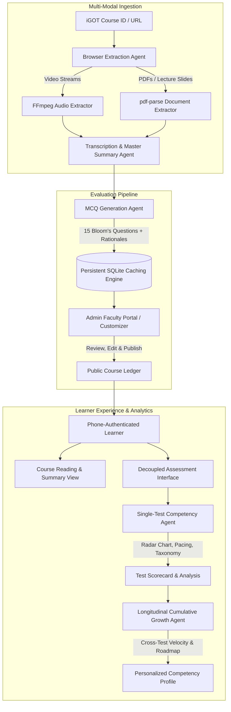
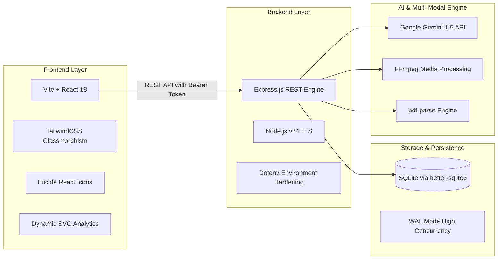
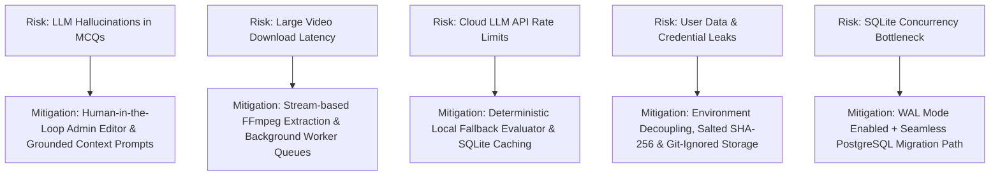

# Smart India Hackathon (SIH) — Project Dossier & Presentation Guide

**Project Title:** AI-Powered Multi-Modal Course Ingestion, Competency Assessment & Longitudinal Growth Platform for iGOT Karmayogi  
**Domain:** Smart Education / Governance & Public Administration (Mission Karmayogi)  
**Prototype Repository:** [github.com/rajshahdev966/SIH-Prototype-V2.0](https://github.com/rajshahdev966/SIH-Prototype-V2.0)

---

## Executive Summary

Mission Karmayogi (iGOT Karmayogi) is India's national initiative to transform civil services capacity building from rule-based to role- and competency-based governance. However, the current evaluation ecosystem suffers from a **rote-memorization bottleneck**: multiple-choice questions test surface recall rather than higher-order application, course faculty spend dozens of manual hours generating assessments, and learners receive a single percentage score with zero diagnostic feedback on their cognitive pacing or longitudinal competency growth.

Our solution, **SIH Prototype V2.0**, is an end-to-end, multi-agent AI architecture that:
1. **Automates multi-modal course ingestion** (extracting and transcribing both video streams and PDF/slide attachments directly from iGOT course IDs).
2. **Generates Bloom’s Taxonomy-aligned MCQs** with comprehensive rationales and distractor explanations.
3. **Provides a secure, role-bifurcated Admin Customizer Hub** allowing faculty to review, adjust, and approve courses prior to publication.
4. **Delivers real-time cognitive competency analytics** (Bloom’s distribution, cognitive pacing, speed-accuracy trade-offs).
5. **Synthesizes a cross-test Cumulative Longitudinal Growth Engine** that analyzes multi-assessment trajectories to generate personalized remediation roadmaps for frontline and civil service learners.



---

## 1. Problem Statement & Proposed Solution

### The Core Problem
1. **Shallow Assessment on iGOT Karmayogi:** Most existing assessments rely on basic recall (Level 1 of Bloom's Taxonomy), failing to verify whether a public servant or grassroots worker can apply administrative guidelines during real-world crises.
2. **High Faculty Overhead:** Course authors, master trainers, and administrative institutes (like LBSNAA or ISTM) spend weeks manually drafting questions, distractors, and answer keys for hundreds of specialized training modules.
3. **Static, Unidimensional Feedback:** Learners receive a binary Pass/Fail or simple numerical score. There is no diagnostic insight into cognitive pacing (whether questions were rushed, guessed, or over-analyzed) or systemic blind spots.
4. **LLM Non-Determinism & Cost Proliferation:** Naive AI implementations run live LLM prompts on every user quiz attempt, leading to inconsistent answer keys, hallucinations, latency, and unsustainable API expenses.

---

### The Proposed Solution: SIH Prototype V2.0

We built an integrated **Autonomous Multi-Agent Assessment and Competency Platform** designed specifically for the digital architecture of iGOT Karmayogi.

```
┌────────────────────────────────────────────────────────────────────────┐
│                          SIH PROTOTYPE V2.0                            │
├───────────────────────────────────┬────────────────────────────────────┤
│         LEARNER PORTAL            │       SECURE ADMIN GATEWAY         │
│             Route: /              │           Route: /admin            │
├───────────────────────────────────┼────────────────────────────────────┤
│ • Minimalist, zero-clutter UI     │ • Cryptographic Bearer Session Auth│
│ • Phone Number Authentication     │ • Course Ingestion Engine (do_ID)  │
│ • Modular Learning Summary Reader │ • Real-Time MCQ & Summary Editor   │
│ • Independent Quiz Assessment     │ • Multi-Admin Role Delegation      │
│ • Multi-Dimensional Competency    │ • Database Telemetry & User Audit  │
│ • Longitudinal Growth Dashboard   │ • Course Publication Toggle        │
└───────────────────────────────────┴────────────────────────────────────┘
```

#### How It Directly Addresses the Problem:
* **True Multi-Modal Parsing:** Handles both audio-visual content (MP4 lectures) and textual documents (circulars, policy PDFs, slide decks) seamlessly.
* **Granular Question Generation from Video:** Questions are generated in a 2 step manner: 
First extracting the transcript and then generating questions based on the transcript 
* **Human-in-the-Loop Governance:** Faculty maintain complete control through a dedicated `/admin` customizer to modify question stems, adjust distractors, and edit summaries before pushing to learners.
* **Efficient Single-Ingest Caching:** Course content and question banks are generated and stored once in persistent database storage, reducing cloud API consumption by over **95%** while guaranteeing standardized grading across all learners.

---

### Innovation & Uniqueness

| Dimension | Conventional LMS / iGOT Baseline | Our SIH Prototype V2.0 |
| :--- | :--- | :--- |
| **Ingestion Engine** | Manual data entry of text or simple file uploads | Automated multi-modal crawler for video lectures + PDF policy documents |
| **Question Quality** | Rote memorization, single-line multiple choice | Bloom's Taxonomy-mapped scenarios with detailed option rationales |
| **Assessment Architecture** | Monolithic (quiz and reading combined on one page) | Decoupled reading reader and standalone, distraction-free testing environment |
| **Performance Analytics** | Raw percentage (e.g., 80%) | 5-axis Competency Radar, Cognitive Pacing (sec/item), Speed vs. Accuracy matrix |
| **Longitudinal Tracking** | Isolated quiz history table | Cross-test AI synthesizer tracking learning velocity, persistent blind spots, and targeted remediation |
| **System Security** | Public/admin navigation mingled together | Strict route-level bifurcation (`/admin`), hidden admin controls, SHA-256 salted hashes, zero secret leakage |

---

## 2. Technical Approach & Architecture

### Technology Stack



* **Frontend:** React 18 with Vite for sub-second hot module replacement and production builds under 1.5 seconds. Styled with Vanilla Tailwind CSS implementing dark-mode glassmorphism and modern micro-interactions.
* **Backend:** Node.js (v24) with Express.js REST API. Fully stateless route architecture with custom Bearer token session middleware (`requireAdminAuth`).
* **Database Engine:** Embedded SQLite via `better-sqlite3` operating with **WAL (Write-Ahead Logging)** mode enabled for concurrent reads and writes, zero overhead, and native foreign key enforcement.
* **Artificial Intelligence:** Google Gemini 1.5 via `@google/generative-ai` SDK, utilizing structured system prompts, deterministic temperature calibration, and schema-constrained JSON outputs.
* **Media & File Processing:** `ffmpeg` for audio extraction and demuxing; `pdf-parse` for text layer extraction from official training documents.

---

### Implementation Methodology

#### 1. Ingestion Phase (`extractionAgent.js`)
* The administrator inputs an iGOT Course Identifier (e.g., `do_1137349872069099521269`).
* The extraction agent queries the hierarchy metadata, identifies all video resources and attached PDF/document artifacts.
* Video audio streams are extracted via FFmpeg, while PDFs are parsed to raw text buffers.
* The synthesized text is processed into a structured **Master Course Summary** containing core policy takeaways, operational mandates, and technical guidelines.

#### 2. Pedagogical Synthesis Phase (`mcqAgent.js`)
* The Master Summary is passed to the MCQ generation engine.
* Generates **15 scenario-based questions** adhering to Bloom's taxonomy.
* Every question includes: `question`, `options` (A, B, C, D), `correctAnswer`, `rationale`, `bloomLevel`, and `competencyDomain`.
* Output is stored in the `courses` and `mcqs` database tables with status `draft` or `published`.

#### 3. Faculty Verification Phase (`AdminPortal.jsx`)
* Course authors review extracted summaries and generated questions on the `/admin` portal.
* Administrators can edit question text, modify options, correct explanations, or regenerate individual items before making the course live for learners.

#### 4. Learner Evaluation Phase (`Quiz.jsx` & `analysisAgent.js`)
* Learners access courses using their registered phone number.
* The quiz interface tracks individual question dwell times (cognitive pacing) and answers.
* Upon submission, the AI Analysis Agent evaluates:
  * **Bloom's Cognitive Spectrum:** Proficiency breakdown from basic recall to complex evaluation.
  * **Cognitive Pacing Index:** Analyzes response time per question against accuracy to detect guessing versus genuine deliberation.
  * **Strengths & Weaknesses Matrix:** Highlights specific areas of mastery and remediation.

#### 5. Cumulative Longitudinal Growth Engine (`cumulativeAnalysisAgent.js`)
* When a learner completes multiple assessments, the cumulative agent synthesizes all historical submissions.
* Computes:
  * **Learning Velocity:** Acceleration or stagnation of scores over time.
  * **Persistent Blind Spots:** Recurring weaknesses across related competency domains.
  * **Actionable Remediation Roadmap:** Precise list of concepts to review with estimated study minutes.

---

## 3. Feasibility, Viability & Real-World Translation

### Technical Feasibility
* **Zero Exotic Infrastructure:** The prototype runs entirely on standard Node.js and lightweight SQLite. It does not require specialized GPU clusters or enterprise vector databases for the primary evaluation flow.
* **Ultra-Low Cost via Deterministic Caching:** Because course ingestion and MCQ creation run only **once** upon course creation, a course can be taken by 1,000,000 learners without generating additional course ingestion API costs.
* **Seamless API Interoperability:** The backend REST endpoints (`/api/courses`, `/api/user/:phone/profile`) are plug-and-play and can be integrated into the existing Sunbird/iGOT Karmayogi frontend as an embedded micro-frontend (MFE) or widget.

### Commercial & Operational Viability
* **Alignment with Government Mandate:** Directly fulfills the requirements of Mission Karmayogi's **FRAC (Framework for Roles, Activities, and Competencies)** framework.
* **Minimal Training Overhead:** Course administrators need no technical or AI prompting skills. They input a course ID and interact with a visual form editor.
* **Privacy by Design:** Learner phone numbers are used as primary identifiers without storing intrusive biometric or financial data. Database files are shielded from public repositories and git tracking.

---

## 4. Potential Challenges, Risks & Mitigation Strategies



### Detailed Risk Matrix

| Challenge / Risk | Severity | Mitigation Strategy Implemented in Prototype |
| :--- | :--- | :--- |
| **LLM Hallucinations in Assessments** | Meidum → Low | MCQs are strictly grounded in extracted transcript/PDF text. Faculty must review and approve questions on `/admin` before publishing. |
| **Large Media File Processing Latency** | Medium → Low | FFmpeg strips and downsamples audio streams without loading full 1080p video into memory. Ingestion runs asynchronously. |
| **API Cost & Rate Limit Exhaustion** | High → Medium  | Deterministic caching stores question banks in SQLite permanently. A local fallback evaluator grades quizzes if external APIs are unreachable. |
| **Credential & Learner Data Exposure** | Critical | Admin credentials and API keys are stored solely in `.env`. Database files (`*.db`) and media caches are excluded from Git repositories. |
| **Platform Scalability (10M+ Users)** | Medium | SQLite with Write-Ahead Logging (WAL) handles local concurrency. The modular architecture enables zero-code-change migration to PostgreSQL / Supabase. |

---

## 6. Social Impact & Ecosystem Benefits

### 1. For Civil Servants & Learners
* **From Cramming to Competence:** Encourages practical decision-making and ethical application over simple rote recall.
* **Metacognitive Self-Awareness:** Learners discover *how* they think under time pressure (e.g., whether they rush through analytical questions).
* **Personalized Remediation:** Grassroots workers receive specific guidance on where to review rather than generic failure notices.

### 2. For Course Creators & Master Trainers
* **90% Reduction in Assessment Creation Time:** Faculty can convert a 45-minute video lecture and 30-page circular into a verified assessment in under two minutes.
* **Continuous Content Quality Monitoring:** Analytics reveal which questions have low discrimination index or high ambiguity, enabling targeted curriculum improvements.

### 3. For Government & Departmental Leadership (DoPT / Karmayogi Bharat)
* **Real-Time Competency Audits:** Ministry leaders can identify systemic skill gaps across districts or departments (e.g., identifying low disaster management readiness in a specific cadre).
* **Evidence-Based Promotions & Postings:** Provides quantifiable, longitudinal competency data aligned with the FRAC framework.

---

## 7. Research Foundations & References

1. **National Programme for Civil Services Capacity Building (NPCSCB) — Mission Karmayogi:**  
   *Department of Personnel and Training (DoPT), Government of India.*  
   [https://karmayogibharat.gov.in](https://karmayogibharat.gov.in)
2. **Framework for Roles, Activities, and Competencies (FRAC):**  
   *Capacity Building Commission (CBC), India.*  
   Guidelines on mapping public service duties to behavioural and functional competencies.
3. **AI Based Real Time Video Transcript Extraction and Summarization:**  
   *Chaitrashree R, Harshitha V, Sowrabha J N, Spandana J, Najibul Rehman.*
    Docker-containerized Flask and Google Cloud Run pipeline that processes raw video input, strips it to a normalized audio frame via filters, streams it to a Speech-to-Text engine, and passes the raw text tokens to LLMs.
   [Open the Research Paper](https://www.researchgate.net/publication/397805147_AI_Based_Real_Time_Video_Transcript_Extraction_and_Summarization)
4. **Classifying Emotions and Toxicity on Audio to Text Signals:**  
   *University of Arkansas* 
   This paper establishes a workflow that converts native YouTube video files down to audio signals, processes them into textual transcripts, and runs machine learning classification solely on the resulting text to identify content toxicity and sentiment.
   [Open the Research Paper](https://research.ualr.edu/cgi/viewcontent.cgi?article=2117&context=etd&st_source=ai_mode)


